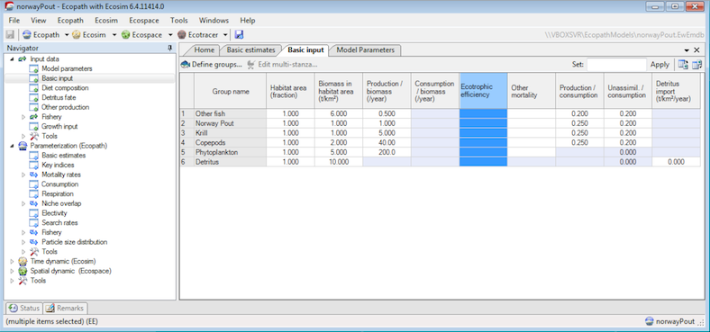

# DEPRECATED

This project is now deprecated, and has been replaced by the [ecopath_matlab package](https://github.com/kakearney/ecopath_matlab-pkg).  Please update; this code will no longer be maintained.

## A Matlab implementation of Ecopath

[Ecopath with Ecosim](http://www.ecopath.org) is a popular ecosystem modeling tool, used primarily in the fisheries modeling community. This Matlab package reproduces the main mass-balance calculation performed by the Ecopath portion of the EwE model, and also offers a few additional tools to examine uncertainty associated with Ecopath model parameters.

### The Ecopath algorithm (`ecopathlite.m`)

The Ecopath algorithm is used to calculate a snapshot of an ecosystem, including the biomass of all functional groups (living groups, fishing gears, and detrital pools) and the fluxes between these groups.  This function is a bare-bones version of the algorithm; it is not really meant to be used to set up and balance a model for the first time, since it does not provide any of the visual checks on the results (e.g. whether EE values are > 1, etc); use the original Ecopath software if you're looking for this type of behavior.  This simply provides the initial mass-balance calculations, in a stripped-down, easy-to-automate format.

For more information on the Ecopath concept, see:

* Christensen, V. & Pauly, D. ECOPATH II--a software for balancing steady-state ecosystem models and calculating network characteristics. Ecological Modelling 61, 169-185 (1992).  
* Christensen, V. & Walters, C. J. Ecopath with Ecosim: methods, capabilities and limitations. Ecological Modelling 172, 109-139 (2004).

### Building an ensemble of Ecopath models (`createensemble.m`)

The construction of a typical Ecopath model involves the compilation of a large amount of population-related data, including biomass, production rates, consumption rates, diet fractions, growth efficiencies, and assimilation efficiencies for each functional group included in the model. These data typically come from a wide variety of sources, ranging from high-quality scientific surveys to fisheries landing data, empirical relationships, and other models. The uncertainty values on these numbers can be very high, up to or beyond an order of magnitude from the point estimates, and accurate measurement of these uncertainties is rare.

I developed an additional routine, `createensemble.m`, in order to incorporate this uncertainty into some of my research (which focuses on end-to-end modeling of ocean ecosystems, and often couples Ecopath-derived concepts with physical and biogeochemical models).  This routine draws Ecopath parameters from probability distributions, based on initial point estimates and data pedigree values (i.e. uncertainty quantified based on data source), checking that the resulting parameter combinations meet the Ecopath mass-balance requirement.

For further reference, and some examples of the ensemble idea in action, see the following publications:

- K. A. Kearney, C. Stock, K. Aydin, and J. L. Sarmiento, “Coupling planktonic ecosystem and fisheries food web models for a pelagic ecosystem: Description and validation for the subarctic Pacific,” Ecol. Modell., vol. 237-238, pp. 43-62, (2012).
- K. A. Kearney, C. Stock, and J. L. Sarmiento, “Amplification and attenuation of increased primary production in a marine food web,” Mar. Ecol. Prog. Ser., vol. 491, pp. 1-14, (2013).

### Syntax

This package includes 3 top-level functions (along with several additional m-files that these 3 rely on)
* `ecopathlite.m`: Reproduces the Ecopath calculation for a single model, or for an ensemble of Ecopath models with the same structure (i.e. same functional groups, predator-prey links, etc)
```
Ep = ecopathlite(Ewein)
[Ep, flag, fillinfo, sc] = ecopathlite(Ewein)
```
* `mdb2ewein.m`: Imports a EwE6 .ewemdb file into Matlab (relies on the [mdbtools utilities](https://github.com/brianb/mdbtools) to read data)
```
Ewein = mdb2ewein(file)
[Ewein, A] = mdb2ewein(file)
```
* `createensemble.m`: Creates an ensemble of Ecopath models, based on parameter uncertainty pedigree values.
```
Set = createensemble(Ewein, pedigree, nset)
```

See function help for full description of input and output variables.

### Examples of use

#### Ecopath mass-balance for a single model

I assume that all users of this Matlab utility are already familiar with the Ecopath with Ecosim software and and its terminology, and already have a completed Ecopath model built that they can play around with.

For example purposes, we will use a simple Ecopath model, borrowed from some of the old EwE5 lab courses: the Norway Pout in the North Sea example.  The food web consists of 6 groups and 2 fishing gears; here's how it appears loaded into EwE6:



We can load the model into Matlab via `mdb2ewein`.  The `displayecopath` command gives a quick preview of the Basic Input data, so we can check that everything looks right.

```matlab
folder = '~/Documents/Research/Working/EcopathModels';
file = fullfile(folder, 'norwayPout.EwEmdb');

In = mdb2ewein(file);
displayecopath(In);
```

```
   Name          TL  HA BH  B  PB  QB  EE  GE   GS  DI 
1: Other fish         1      6 0.5          0.2 0.2 0
2: Norway Pout        1      1   1         0.25 0.2 0
3: Krill              1      1   5         0.25 0.2 0
4: Copepods           1      2  40         0.25 0.2 0
5: Phytoplankton      1      5 200                0 0
6: Detritus           1     10           0        0 0
```

Behind the scenes, EwE6 seems to always store the EE value for the last detritus group as 0 rather than the missing-value placeholder.  We'll correct this discrepancy manually:

```matlab
In.ee(end) = NaN;
displayecopath(In);
```
```
   Name          TL  HA BH  B  PB  QB  EE  GE   GS  DI 
1: Other fish         1      6 0.5          0.2 0.2 0
2: Norway Pout        1      1   1         0.25 0.2 0
3: Krill              1      1   5         0.25 0.2 0
4: Copepods           1      2  40         0.25 0.2 0
5: Phytoplankton      1      5 200                0 0
6: Detritus           1     10                    0 0
```

We can now calculate the Ecopath mass-balance, and fill in the unknowns.
```matlab
Ep = ecopathlite(In);
displayecopath(In, Ep);
```
```
   Name          TL      HA BH B  PB  QB  EE        GE   GS  DI 
1: Other fish     3.14461 1  6  6 0.5 2.5  0.333333  0.2 0.2 0
2: Norway Pout      3.607 1  1  1   1   4    0.7765 0.25 0.2 0
3: Krill                3 1  1  1   5  20    0.7496 0.25 0.2 0
4: Copepods             2 1  2  2  40 160  0.434087 0.25 0.2 0
5: Phytoplankton        1 1  5  5 200   0     0.288    0   0 0
6: Detritus             1 1 10 10   0   0 0.0384362    0   0 0
```
That's it!  You can browse through the other fields of the `Ep` structure to see some of the other Ecopath output data (mortality rates, detritus flows, etc).

#### Building an ensemble of Ecopath models

The `pedigree` input variable should be an ngroup x 6 array, where ngroup is the number of groups in your model, with columns corresponding to the B, PB, QB, DC, EE, and GE variables, respectively.  The mdb2ewein.m function will return a predigree array (with one extra column, for catch, which I ignore... you can pass this array directly, since createensemble.m ignores any extra columns in the pedigree input array).  If your model doesn't have pedigree data stored with it (like this example), then you can build this array manually.

For this example, lets assume a 20% uncertainty on all biomass (B), production rate (PB), and growth efficiency (GE) variables, and a 10% uncertainty for the diet composition components.  The pedigree values assigned to unknown parameters (in this case, all QB and EE values) will not be used; I like to assign a NaN to these values (which tells createensemble.m not to vary these parameters from their initial point value), just to be safe.

```matlab
ped = repmat([0.2 0.2 NaN 0.1 NaN 0.2], In.ngroup, 1);

```

Now generate a 1000-member ensemble, using lognormal distributions for all parameters:

```matlab
Set = createensemble(In, ped, 1000, 'pdfname', 'lognormal');
```
Progress will be printed to the screen via a text progress bar.
```
Generating ensembles...
 100% [=================================================>] Attempted: 1240
```
Some food webs can remain balanced even with large variations in input parameters, and will return a large number of models quickly, such as in this case.  This simple model coupled with relatively low uncertainty rates shows a ~80% balance rate (i.e when parameters are drawn randomly from the assigned distributions, approximately 80% of the resulting Ecopath models meet the criteria that all 0 <= EE <= 1).  More complicated food webs with much higher uncertainty can show balance rates closer to 0.1%, and will take much longer to generate an ensemble.  It's a good idea to start with a small sample request (~10 or so) to get an idea of how long this step might take.

For memory purposes, this function returns only the parameter values that vary between ensemble members.  To get back to the potentially more useful Ecopath input structure format, use `subecopathens`:

```matlab
In2 = subecopathens(In, Set.x, Set.idx);
displayecopath(In2(1))
```
```
   Name          TL  HA BH  B        PB      QB  EE  GE       GS  DI 
1: Other fish         1      6.09372  0.5318         0.204044 0.2 0
2: Norway Pout        1     0.913908 1.14491         0.289519 0.2 0
3: Krill              1      1.04301 5.03851         0.258823 0.2 0
4: Copepods           1      2.26621 37.3658         0.266372 0.2 0
5: Phytoplankton      1      4.41425 229.472                    0 0
6: Detritus           1      9.69848                            0 0
```

The ecopathlite.m function can now calculate balance for an entire ensemble at once; this saves time over the previous necessity to loop over each (since setup calculations are the same for all ensemble members):

```matlab
Ep2 = ecopathlite(Set.Ewein, 'x', Set.x, 'idx', Set.idx);
displayecopath(In2(1), Ep2(1))
```
```
   Name          TL      HA BH B        PB      QB  EE        GE       GS  DI 
1: Other fish     3.14461 1  6  6.09372  0.5318 2.5  0.333333 0.204044 0.2 0
2: Norway Pout      3.607 1  1 0.913908 1.14491   4    0.7765 0.289519 0.2 0
3: Krill                3 1  1  1.04301 5.03851  20    0.7496 0.258823 0.2 0
4: Copepods             2 1  2  2.26621 37.3658 160  0.434087 0.266372 0.2 0
5: Phytoplankton        1 1  5  4.41425 229.472   0     0.288        0   0 0
6: Detritus             1 1 10  9.69848       0   0 0.0384362        0   0 0
```


